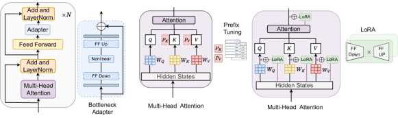

# bnb vs gguf
* GGUF: unified file format designed for fast inference on consumer hardward (Deployment and in llama.cpp ecosystem)
* BnB (bitsandbytes) applies on-the-fly quantization within the PyTorch/Hugging Face ecosystem, making it the standard choice for LLM training and fine-tuning (like QLoRA).

# Model types:
* LLM model have been trained with different prediction patterns(data, format, objectives, post-training methods) -> different variants to serve different purposes
* They usually align model with one type of purpose each time, and the data format can be text, json, code,..., newer alignments probaly slightly impact the old ones.
* Variants usually overlap other' roles, like coder and instructor, but they are not necessarily exclusive.

# How to mitigrate multiple allignments problems:
1. small learning rate
2. Use different adapters (like QLoRA) for different tasks or train model with different of final layers method called MTL (multi-task learning).
    * => Reduce the performance but make it more stable and every objective can shine on their own fields.
    * Where adapters live insde a transformer layer:

# Multimodal vs Agents
* Multimodal models are designed to process multiple types of data simultaneously, such as images, text, audio, etc. It's like a wholesome chief who can cook everything.
* Agents on the other hand is a leader who make decision and assign task for other team members, each for a specific area.
    => They both can finish multiple type of tasks, but they are not necessarily exclusive.

# RAG standard workflow:
User Query
    ↓
Embedding Model
    ↓
Vector Search
    ↓
Retrieve Documents
    ↓
Context Injection
    ↓
LLM
    ↓
Final Answer

# RAG advanced workflow:
Query
 ↓
Query Rewrite (Many strategies)
 ↓
Hybrid Search (Many strategies)
 ↓
Reranker
 ↓
Context Compression
 ↓
LLM

## Metadata in RAG:
* Metadata is like headline which tells us what the document is about.

GGUF file format need to use Llama_cpp to load and run, and it's super lightweight